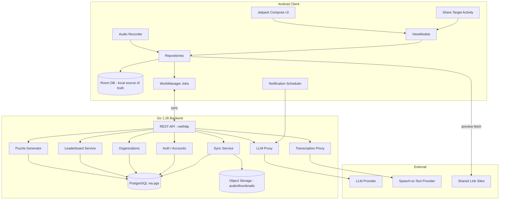
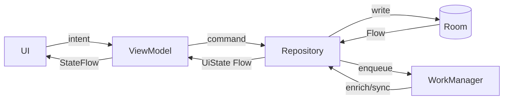

# Design Document

## Overview

The Action Tracker App turns content people save while browsing into tracked, actionable tasks, and adds voice journaling and daily memory games with organization leaderboards. This design targets **Android first** with a clean separation between a native Android (Kotlin) client and a standalone **Go backend**, so the same backend and a shared OpenAPI contract can be reused when the iOS client is built later.

The backend is implemented in **Go 1.26**. Clients communicate with it exclusively over REST/JSON defined by an OpenAPI 3 contract, so the backend language is independent of any client. The pure domain logic that is shared between the Android client and the server (sync conflict resolution, leaderboard aggregation, puzzle generation) is specified once and implemented on each side (Kotlin on the client, Go on the server); the same Correctness Properties validate both implementations to keep their behavior identical.

The system is **offline-first**: the Android client owns a local source of truth (an on-device database) and synchronizes with the backend in the background. Users can capture, view, and edit Action_Items with no network connection; changes reconcile when connectivity returns. Network-dependent enrichment (link previews, LLM text, transcription) degrades gracefully and never blocks the core capture flow.

### Goals

- Frictionless capture via the OS share sheet, with non-blocking link preview enrichment.
- Reliable offline-first persistence with eventual cloud sync across devices.
- Helpful, LLM-curated reminders and suggestions that fail soft.
- Hands-free voice journaling with transcription and action extraction.
- Engaging daily games with deterministic per-organization puzzles and day/week/month leaderboards that reset monthly.

### Android-First, iOS-Ready Strategy

The design isolates platform-specific concerns from portable logic so iOS reuse is maximized:

| Layer | Android-first choice | iOS reuse path |
| --- | --- | --- |
| Backend API | Single Go REST/JSON API (accounts, org, sync, leaderboards, LLM proxy) | Reused unchanged by iOS client |
| Domain models | Kotlin data classes generated/mirrored from the OpenAPI schema | Re-expressed as Swift structs from the same OpenAPI contract |
| Puzzle generation | Deterministic seed algorithm specified in backend (server-authoritative) | iOS calls same endpoint; identical puzzles |
| Sync protocol | Versioned, timestamped, last-writer-wins-with-tombstones over REST | Identical protocol on iOS |
| Client UI/runtime | Kotlin + Jetpack Compose, Room, WorkManager | SwiftUI + a local store (e.g., SQLite/GRDB) implementing the same contracts |

The contract between client and backend is defined as an OpenAPI document so both clients consume one source of truth.

## Architecture

### High-Level Architecture



### Client Architecture (Android)

The client follows MVVM + a repository layer with unidirectional data flow:

- **UI (Jetpack Compose)**: Stateless composables render `UiState` exposed by ViewModels.
- **ViewModels**: Hold screen state as Kotlin `StateFlow`, handle user intents, call repositories. Survive configuration changes.
- **Repositories**: The single entry point for data. They read/write Room, enqueue sync work, and orchestrate enrichment (previews, LLM, transcription). Repositories expose Room-backed `Flow`s so the UI updates reactively as the local DB changes.
- **Room database**: The local source of truth. All reads for display come from Room, guaranteeing offline availability.
- **WorkManager**: Runs deferrable, guaranteed background jobs — sync push/pull, link preview fetch, LLM notification text generation, transcription upload, and scheduled daily reminders. Jobs are constrained (e.g., network-required jobs wait for connectivity) and retried with backoff.



### Recommended Technology Stack

**Android client**
- Language: **Kotlin**
- UI: **Jetpack Compose** + Material 3
- Local DB: **Room** (SQLite) with Kotlin coroutines/Flow
- Background work: **WorkManager**
- Dependency injection: **Hilt**
- Networking: **Retrofit + OkHttp** with **kotlinx.serialization** (or Moshi)
- Audio: **MediaRecorder** / `AudioRecord` for capture
- Notifications: `NotificationManager` + WorkManager scheduling
- Auth token storage: **EncryptedSharedPreferences** / Jetpack Security

**Backend**
- Language/runtime: **Go 1.26**
- HTTP: Go standard library **`net/http`** with the 1.22+ enhanced routing (optionally a light router such as **chi**)
- Database: **PostgreSQL** accessed via **pgx**, with **sqlc** for type-safe queries (migrations via **goose** or **golang-migrate**)
- Object storage: **S3-compatible** store (AWS SDK for Go v2) for audio files and cached thumbnails
- Auth: **JWT** access tokens + refresh tokens (**golang-jwt**); password hashing with **argon2** (`golang.org/x/crypto/argon2`) or **bcrypt**
- Scheduling (server side): cron-style jobs (e.g., **robfig/cron**) for leaderboard period rollover and daily puzzle pre-generation
- LLM provider: pluggable adapter (e.g., OpenAI/Anthropic/Bedrock) behind an LLM Proxy
- Speech-to-text: pluggable adapter (cloud STT) behind a Transcription Proxy
- API contract: **OpenAPI 3** specification shared by both platforms (Go server types and Kotlin/Swift client models generated from it via **oapi-codegen** and client generators)

### Why a Backend Is Required

Several requirements cannot be satisfied purely on-device:
- Cross-device sync (13.4, 14.4) needs a server-side authoritative store.
- Organization-shared daily puzzles (11.2) require a server-authoritative seed/word source so all members get identical puzzles.
- Organization leaderboards (12.x) require aggregation across users.
- LLM and transcription API keys must not ship in the client; they are proxied through the backend.

## Components and Interfaces

### Capture_Service (Android share target)

Registered via an Android `intent-filter` for `ACTION_SEND` and `ACTION_SEND_MULTIPLE` with MIME types `text/plain`, `image/*`, and `video/*`. A dedicated `ShareTargetActivity` receives the intent.

Flow:
1. Receive intent → classify content type (link, text, image, video reference).
2. If unsupported MIME type → show "content type not supported" message and discard (Req 1.4).
3. Otherwise launch the categorization sheet (Bucket + Timeframe selection) (Req 1.3).
4. If the content contains a URL, kick off `Preview_Service` asynchronously (Req 1a).
5. On confirm → create Action_Item with status "not started" (Req 1.5).

```kotlin
interface CaptureService {
    fun classify(intentData: SharedIntentData): ContentType // Link | Text | Image | VideoRef | Unsupported
    suspend fun beginCapture(item: SharedItem): CaptureDraft
    suspend fun confirmCapture(draft: CaptureDraft, bucketId: String, timeframe: Timeframe): ActionItem
}
```

### Preview_Service (link metadata)

Fetches Open Graph / Twitter Card metadata for shared URLs. Runs off the capture critical path with a configurable timeout (default ~5s).

- On success: store title, thumbnail URL (downloaded/cached), source name with the Action_Item (Req 1a.2).
- On failure: store raw link, display raw link (Req 1a.4).
- On timeout: save Action_Item with raw link immediately; do not block (Req 1a.5). If enrichment later succeeds, the Action_Item is updated reactively.

```kotlin
interface PreviewService {
    suspend fun fetchPreview(url: String, timeoutMs: Long = 5000): PreviewResult
}
sealed interface PreviewResult {
    data class Success(val title: String, val thumbnailUrl: String?, val sourceName: String) : PreviewResult
    data class Failure(val rawUrl: String) : PreviewResult
    data class Timeout(val rawUrl: String) : PreviewResult
}
```

### Board and Completion_Counter

The Board reads an aggregated `Flow<BoardState>` from the repository: Action_Items grouped by Bucket, sorted ascending by creation time within each bucket (Req 4.1, 4.2). Each item carries a status color (Req 4.3–4.5). The Completion_Counter is derived from the count of items with status "completed" (Req 5.4) and recomputed reactively whenever statuses change.

### Bucket management

CRUD over buckets with a uniqueness constraint on name per account (Req 2.6). Deleting a non-empty bucket triggers a reassign-or-delete decision for contained items (Req 2.5).

### Notification_Service

- Requests POST_NOTIFICATIONS permission on first launch (Req 6.1).
- Daily reminder scheduled via WorkManager at the user-selected time (Req 6.3, 6.4) using a periodic/one-shot rescheduling pattern aligned to the chosen local time.
- At fire time, gathers Action_Items due that day and requests LLM text (Req 7.1); if none due, sends a "review upcoming" prompt (Req 6.6).
- On denied permission, shows explanation + deep link to OS notification settings (Req 6.5).

### LLM_Service (via backend LLM Proxy)

Client never holds provider keys. The client calls the backend LLM Proxy, which calls the provider. All calls have timeouts and fail soft:
- Notification text (Req 7.1) → fall back to default text on error/timeout (Req 7.4).
- Action suggestions for an item (Req 7.2).
- Task description generation from shared content (Req 7.3).
- Action extraction from transcripts (Req 10.5).

```kotlin
interface LlmService {
    suspend fun notificationText(items: List<ActionItemSummary>): LlmResult<String>
    suspend fun suggestActions(item: ActionItem): LlmResult<List<String>>
    suspend fun describe(content: SharedItemContent): LlmResult<String>
    suspend fun extractActions(transcript: String): LlmResult<List<ExtractedAction>>
}
sealed interface LlmResult<out T> {
    data class Ok<T>(val value: T) : LlmResult<T>
    data object Unavailable : LlmResult<Nothing>
    data object TimedOut : LlmResult<Nothing>
}
```

### Voice journaling

- Request microphone permission on first record (Req 10.1).
- Capture audio until stopped (Req 10.2); store audio file reference + transcript as a Voice_Journal_Entry (Req 10.4).
- On stop, send audio to Transcription Proxy (Req 10.3); on failure retain audio and show failure message (Req 10.8).
- On transcript success, request LLM extraction (Req 10.5), present extracted items for confirmation (Req 10.6), and on confirm create Action_Items prompting for Bucket + Timeframe (Req 10.7).

### Games engine

Two games sharing a common interface; puzzles are server-authoritative for an organization+date.

```kotlin
interface DailyGame<P : Puzzle, M : Move, R : MoveResult> {
    fun puzzleFor(orgId: String, date: LocalDate): P   // deterministic
    fun applyMove(puzzle: P, state: GameState, move: M): Pair<GameState, R>
    fun score(state: GameState): Int
    fun isComplete(state: GameState): Boolean
}
```

- **Word_Guess**: per-guess feedback marks each letter as correct / present / absent (Req 11.5).
- **Spelling_Bee**: accepts a word only if it uses allowed letters and is in the word list (Req 11.6).
- Replay guard: once a user completes a game for a date, re-entry shows the recorded result without rescoring (Req 11.4).

### Leaderboard_Service (backend)

Maintains per-organization daily, weekly, and monthly aggregates. On score recording, updates all three period boards for the user's org (Req 12.2), ranks descending by total score for the period (Req 12.3). Period boundaries (day/week/month) determine the active board; monthly board resets at month start (Req 12.4), with new day/week boards beginning at their boundaries (12.5, 12.6).

### Accounts and Organizations (backend)

Account creation (Req 13.1), optional org join (Req 13.2), and association of all user data with the account (Req 13.3). Sign-in on a new device pulls the user's data via sync (Req 13.4). Opening a leaderboard with no org membership shows a join prompt (Req 13.5).

### Sync Service (offline-first)

The repository writes locally first, then enqueues sync. Sync uses:
- A monotonically increasing `updatedAt` (server time on push-ack) and a client `dirty` flag per record.
- **Tombstones** for deletes so deletions propagate.
- **Last-writer-wins** conflict resolution keyed on `updatedAt`, with the loser preserved in a conflict log for auditing.
- A per-entity `version` to detect concurrent modification.

```
POST /sync/push  { changes: [Entity...] , lastSyncToken }  -> { applied, conflicts, newSyncToken }
GET  /sync/pull?since={syncToken}                          -> { changes: [Entity...], newSyncToken }
```

Network-unavailable behavior: all reads/writes hit Room; the push/pull jobs are network-constrained WorkManager tasks that run when connectivity returns (Req 14.4).

## Data Models

Models are defined by the shared **OpenAPI 3 schema**. They are shown here as Kotlin data classes for the Android client; the Go backend defines equivalent structs generated from the same schema (e.g., via oapi-codegen), and iOS later mirrors them as Swift structs. IDs are client-generated UUIDs so records can be created offline without server round-trips. All syncable entities carry sync metadata.

```kotlin
// Common sync metadata embedded in syncable entities
data class SyncMeta(
    val updatedAt: Long,     // epoch millis, server-authoritative after ack
    val version: Long,       // increments per update; concurrency detection
    val deleted: Boolean,    // tombstone flag
    val dirty: Boolean       // client-only: pending push
)

enum class ActionStatus { NOT_STARTED, IN_PROGRESS, COMPLETED }

sealed interface Timeframe {
    data object Today : Timeframe
    data object WithinADay : Timeframe
    data object WithinAWeek : Timeframe
    data class SpecificDate(val date: LocalDate) : Timeframe  // must be today or later
}

enum class ContentType { LINK, TEXT, IMAGE, VIDEO_REF }

data class LinkPreview(
    val title: String?,
    val thumbnailUrl: String?,
    val sourceName: String?,
    val rawUrl: String,
    val resolved: Boolean    // false => display rawUrl
)

data class ActionItem(
    val id: String,                 // UUID
    val accountId: String,
    val bucketId: String,
    val title: String,
    val description: String?,       // may be LLM-generated
    val contentType: ContentType,
    val sourceContent: String?,     // raw text / link / media reference
    val preview: LinkPreview?,      // present for LINK items
    val timeframe: Timeframe,
    val status: ActionStatus,
    val createdAt: Long,            // ordering within bucket
    val isWishlistItem: Boolean,
    val wishlist: WishlistFields?,  // present when in a shopping bucket
    val sync: SyncMeta
)

data class Bucket(
    val id: String,
    val accountId: String,
    val name: String,               // unique per account
    val isShopping: Boolean,
    val notStartedColor: String,    // status indicator colors
    val inProgressColor: String,
    val completedColor: String,
    val sync: SyncMeta
)

data class ActionPlan(
    val id: String,
    val actionItemId: String,
    val subActions: List<SubAction>, // ordered
    val sync: SyncMeta
)

data class SubAction(
    val id: String,
    val text: String,
    val order: Int,                 // defines sequence
    val completed: Boolean
)

data class WishlistFields(
    val productName: String,
    val sourceLink: String?,
    val purchased: Boolean
)

data class VoiceJournalEntry(
    val id: String,
    val accountId: String,
    val audioRef: String,           // object storage key / local path
    val transcript: String?,        // null if transcription failed
    val transcriptionFailed: Boolean,
    val createdAt: Long,
    val extractedActionItemIds: List<String>,
    val sync: SyncMeta
)

// ---- Games & Leaderboards ----

enum class GameType { SPELLING_BEE, WORD_GUESS }

data class DailyPuzzle(
    val orgId: String,
    val gameType: GameType,
    val date: LocalDate,
    val seed: Long,                 // deterministic from (orgId, gameType, date)
    val spec: PuzzleSpec            // letters/word depending on game
)

sealed interface PuzzleSpec {
    data class SpellingBee(val letters: List<Char>, val centerLetter: Char) : PuzzleSpec
    data class WordGuess(val answer: String, val maxAttempts: Int) : PuzzleSpec
}

enum class LetterFeedback { CORRECT, PRESENT, ABSENT }

data class GameResult(
    val id: String,
    val accountId: String,
    val orgId: String,
    val gameType: GameType,
    val date: LocalDate,
    val score: Int,
    val completedAt: Long,
    val sync: SyncMeta
)

enum class LeaderboardPeriod { DAY, WEEK, MONTH }

data class LeaderboardEntry(
    val accountId: String,
    val displayName: String,
    val totalScore: Int,
    val rank: Int
)

data class Leaderboard(
    val orgId: String,
    val period: LeaderboardPeriod,
    val periodKey: String,          // e.g. "2025-06-14", "2025-W24", "2025-06"
    val entries: List<LeaderboardEntry> // sorted descending by totalScore
)

data class Account(
    val id: String,
    val email: String,
    val displayName: String,
    val orgId: String?,             // null => not in an organization
    val createdAt: Long
)

data class Organization(
    val id: String,
    val name: String,
    val createdAt: Long
)
```

### Persistence notes

- Room stores all of the above (sealed types persisted via type converters; the `Timeframe`/`PuzzleSpec` discriminator + payload). Display queries read from Room only.
- Audio files are stored on device and uploaded to object storage by a sync job; `audioRef` points to local path until uploaded, then to the storage key.
- Backend PostgreSQL schema mirrors these entities; leaderboards are materialized aggregates keyed by `(orgId, gameType, period, periodKey)` and recomputed/incremented on score writes.

## Correctness Properties

*A property is a characteristic or behavior that should hold true across all valid executions of a system — essentially, a formal statement about what the system should do. Properties serve as the bridge between human-readable specifications and machine-verifiable correctness guarantees.*

These properties target the pure logic of the system (capture/classification, board aggregation, validation, games, leaderboards, sync). The client-side logic is implemented in Kotlin and the server-side shared logic (sync conflict resolution, leaderboard aggregation, puzzle generation) is implemented in Go; the same properties below are used to validate both implementations so their behavior stays identical. Infrastructure, OS permission flows, UI placement, and external LLM/STT/audio behavior are validated with example/integration/smoke tests instead (see Testing Strategy).

### Property 1: Unsupported content is rejected and never persisted

*For any* shared content whose type is not one of {link, text, image, video reference}, classification returns "unsupported" and no Action_Item is created.

**Validates: Requirements 1.4**

### Property 2: Confirming capture creates a not-started item preserving its bucket and timeframe

*For any* capture draft, valid bucket, and valid timeframe, confirming capture produces an Action_Item whose status is "not started" and whose bucket and timeframe equal the selected values.

**Validates: Requirements 1.5**

### Property 3: A resolved link preview is stored faithfully

*For any* successful preview result, the resulting Action_Item's preview carries the same title, thumbnail, and source name, with `resolved == true`.

**Validates: Requirements 1a.2**

### Property 4: An unresolved preview falls back to the raw link without blocking capture

*For any* link URL, when the preview fails or times out, capture still completes and the resulting Action_Item stores a preview with `resolved == false` whose `rawUrl` equals the original URL.

**Validates: Requirements 1a.4, 1a.5**

### Property 5: Bucket names are unique per account

*For any* set of existing buckets, attempting to create a bucket whose (normalized) name already exists is rejected and leaves the set of buckets unchanged.

**Validates: Requirements 2.6**

### Property 6: Deleting a non-empty bucket reassigns or deletes all of its items

*For any* bucket containing items, choosing "reassign" moves every contained item to the target bucket (none lost, source emptied), and choosing "delete" removes exactly those items; total item accounting is preserved in both cases.

**Validates: Requirements 2.5**

### Property 7: Specific-date timeframes accept today or later and reject the past

*For any* calendar date, selecting it as a specific-date timeframe is accepted if and only if the date is the current date or later; earlier dates are rejected.

**Validates: Requirements 3.3**

### Property 8: The board partitions items by bucket without loss

*For any* set of Action_Items, the board's grouped output contains every input item exactly once, and within each group every item's `bucketId` equals that group's bucket.

**Validates: Requirements 4.1**

### Property 9: Items within a bucket are ordered by ascending creation time

*For any* set of Action_Items, each bucket group is sorted in non-decreasing order of `createdAt`.

**Validates: Requirements 4.2**

### Property 10: The status indicator color always matches the item's current status

*For any* Action_Item, the displayed indicator color equals the bucket's configured color for the item's current status, including immediately after a status change.

**Validates: Requirements 4.3, 4.4, 4.5, 4.7**

### Property 11: The completion counter equals the number of completed items

*For any* set of Action_Items and *any* sequence of status changes applied to them, the Completion_Counter equals the count of items whose status is "completed".

**Validates: Requirements 5.2, 5.3, 5.4**

### Property 12: The daily due-set contains exactly the items due that day

*For any* set of Action_Items and *any* date, the computed "due today" set contains exactly those items whose timeframe resolves to that date (today/within-a-day/within-a-week/specific-date resolved correctly).

**Validates: Requirements 6.4**

### Property 13: LLM features fail soft

*For any* request, when the LLM result is unavailable or timed out, the operation still completes: notification text falls back to non-empty default text, and suggestion/description flows complete with an "unavailable" signal rather than blocking or erroring.

**Validates: Requirements 7.4, 7.5**

### Property 14: Items in a shopping bucket are wishlist items

*For any* Action_Item, `isWishlistItem` is true and wishlist fields are present if and only if its bucket is a shopping bucket.

**Validates: Requirements 8.2**

### Property 15: Marking a wishlist item purchased completes it

*For any* wishlist item, marking it purchased sets `purchased == true` and sets its Action_Status to "completed".

**Validates: Requirements 8.5**

### Property 16: Sub-action progress count is accurate

*For any* Action_Plan, the displayed completed count equals the number of completed sub-actions and the total equals the number of sub-actions, with `0 <= completed <= total`.

**Validates: Requirements 9.3**

### Property 17: The "mark complete" prompt appears exactly when all sub-actions are done

*For any* non-empty Action_Plan, the prompt to mark the parent Action_Item completed is shown if and only if every sub-action is completed.

**Validates: Requirements 9.4**

### Property 18: Reordering sub-actions is a permutation with contiguous ordering

*For any* Action_Plan and *any* requested ordering, reordering preserves the exact set of sub-actions (none added or lost) and yields order indices forming a contiguous sequence in the requested order.

**Validates: Requirements 9.5**

### Property 19: Extracted actions are created only on confirmation, one per confirmed item

*For any* list of extracted actions, no Action_Items exist before confirmation; after confirming a subset S, exactly |S| Action_Items are created and linked to the originating Voice_Journal_Entry.

**Validates: Requirements 10.6, 10.7**

### Property 20: Transcription outcomes are stored correctly

*For any* recording, a successful transcription stores a Voice_Journal_Entry preserving the audio reference and transcript with `transcriptionFailed == false`; a failed transcription retains the audio reference with `transcript == null` and `transcriptionFailed == true`.

**Validates: Requirements 10.4, 10.8**

### Property 21: Daily puzzles are deterministic per organization and date

*For any* organization, game type, and date, generating the daily puzzle yields an identical puzzle on every generation, so all users in the same organization on the same day receive the same puzzle.

**Validates: Requirements 11.2**

### Property 22: Completing a game records exactly one score

*For any* completed game play, exactly one Game result is recorded with the matching game type and date and the score computed from the final game state.

**Validates: Requirements 11.3**

### Property 23: Replaying a completed daily game does not rescore

*For any* user, game, and date that is already completed, a second completion attempt leaves both the number of recorded scores and the recorded score value unchanged and returns the existing result.

**Validates: Requirements 11.4**

### Property 24: Word_Guess feedback is correct, including duplicate letters

*For any* answer and guess of equal length, the feedback has the same length as the guess; every position whose letter equals the answer's letter is marked "correct"; "present" markings never exceed the count of remaining (non-correct-matched) occurrences of that letter in the answer; and a guess equal to the answer yields all "correct".

**Validates: Requirements 11.5**

### Property 25: Spelling_Bee acceptance follows the allowed-letters and word-list rule

*For any* candidate word, it is accepted if and only if all of its letters are in the puzzle's allowed letter set and the word exists in the app word list.

**Validates: Requirements 11.6**

### Property 26: Recording a score updates all three period leaderboards by that score

*For any* sequence of recorded scores, each leaderboard's per-user total equals the sum of that user's scores falling within the board's period, for the daily, weekly, and monthly boards of the user's organization.

**Validates: Requirements 12.2**

### Property 27: Leaderboards are ranked by descending total score

*For any* set of recorded scores, leaderboard entries are ordered by non-increasing total score and each entry's rank is consistent with that ordering.

**Validates: Requirements 12.3**

### Property 28: Leaderboards isolate scores by period key

*For any* set of scores, a leaderboard for a given period key contains only scores whose date maps to that period key, so a new day, week, or month starts with no carried-over scores (monthly reset, new daily/weekly boards).

**Validates: Requirements 12.4, 12.5, 12.6**

### Property 29: Data created while signed in is associated with the current account

*For any* Action_Item, Bucket, Voice_Journal_Entry, or Game result created while signed in as account A, the entity's `accountId` equals A.

**Validates: Requirements 13.3**

### Property 30: Sync makes data available across devices (round trip)

*For any* set of local records on one device, after pushing to the backend and pulling on a second device signed in to the same account, the second device's non-deleted records equal the first device's records.

**Validates: Requirements 13.4**

### Property 31: Persistence round trip survives restart, edits, and deletes

*For any* set of entities (Action_Items, Buckets, Action_Plans, Wishlist_Items, Voice_Journal_Entries, including all Timeframe variants), writing them and then reloading the database reproduces identical records; after an edit the reloaded fields reflect the edit, and after a delete the record is absent.

**Validates: Requirements 14.2, 14.3, 3.4**

### Property 32: Conflict resolution is deterministic last-writer-wins

*For any* two concurrent versions of the same record, the merged result equals the version with the greater `updatedAt`; the merge is deterministic and order-independent (commutative).

**Validates: Requirements 14.4**

## Error Handling

The system is designed to fail soft and keep the core capture/track experience usable regardless of network or external-service failures.

### Capture and previews
- **Unsupported content**: show a clear "content type not supported" message and discard the item (Req 1.4).
- **Preview failure**: store and display the raw link (Req 1a.4).
- **Preview timeout**: complete capture immediately with the raw link; if a later background fetch succeeds, the item is updated reactively via its Room-backed Flow (Req 1a.5).

### Network and sync
- All reads/writes go to the local Room database first, so the UI works fully offline (Req 14.4).
- Sync push/pull are network-constrained WorkManager jobs with exponential backoff retry; transient failures are retried, not surfaced as errors.
- Conflicts resolve via deterministic last-writer-wins (`updatedAt`); the losing version is written to a conflict log for audit but does not block the user.
- Deletes propagate via tombstones so a delete on one device is not "resurrected" by a stale record from another.

### LLM and transcription
- All LLM calls are time-boxed. On error/unavailable, notifications use default text (Req 7.4); suggestion/description requests complete and inform the user that suggestions are unavailable (Req 7.5).
- Transcription failure retains the audio recording and shows a failure message; the user can retry transcription later (Req 10.8).

### Permissions
- Notification permission denied: show explanation and a deep link to OS notification settings (Req 6.5).
- Microphone permission denied: explain why it is needed and route to settings; recording is blocked until granted (Req 10.1).

### Validation
- Bucket name uniqueness is enforced with a normalized (trimmed, case-insensitive) comparison before write (Req 2.6).
- Specific-date timeframes earlier than today are rejected at input time with a corrective message (Req 3.3).

### Backend
- API errors return structured problem responses (code + message); the client maps known codes to user-facing messages and treats unknown errors as transient (retry) where safe.
- Auth: expired access tokens trigger a silent refresh; failed refresh routes to re-authentication without losing locally stored data.

## Testing Strategy

The feature contains substantial pure logic (classification, board aggregation, validation, completion counting, due-set computation, games scoring/generation, leaderboard aggregation, sync conflict resolution). This logic is well suited to **property-based testing**, on the Kotlin client and on the Go backend. Platform/OS integration, UI placement, and external service behavior are covered with example, integration, and smoke tests.

### Dual approach

- **Property-based tests** verify the universal Correctness Properties above across many generated inputs.
- **Example/unit tests** verify specific scenarios, UI branches, and concrete flows.
- **Integration tests** verify external-service wiring (LLM proxy, STT, audio capture) with 1–3 representative cases.
- **Smoke tests** verify one-time configuration (share-target registration, permission requests on first launch, both games present, Android build/run).

### Property-based testing setup

- **Library**: use a property-based testing library rather than implementing one from scratch.
  - Android/Kotlin client logic: **Kotest property testing** (or **jqwik** for JUnit-based modules).
  - Go backend shared logic (sync conflict resolution, leaderboard aggregation, puzzle generation): Go's built-in **`testing/quick`** or **gopter** / **rapid** for richer generators.
- **Iterations**: each property test runs a **minimum of 100 iterations**.
- **Generators**: build generators for Action_Items (all Timeframe variants, content types), bucket sets, Action_Plans, score sequences with dates spanning day/week/month boundaries, answer/guess word pairs (including duplicate letters), and pairs of concurrent record versions for conflict testing.
- **Traceability**: tag each property test with a comment referencing its design property, in the format:
  - `// Feature: action-tracker-app, Property {number}: {property_text}`
- Implement **each Correctness Property with a single property-based test** (Properties 1–32).

### Example/unit tests (representative)

- Share intent dispatch launches the categorization flow (Req 1.2, 1.3).
- Board row renders preview title + thumbnail for a link item (Req 1a.3).
- Bucket create/rename/delete CRUD (Req 2.1–2.4).
- Timeframe option set and date-picker minimum (Req 3.1, 3.2).
- Status change persists (Req 4.6); counter rendered at top of board (Req 5.1).
- Reminder toggle and time persist (Req 6.2, 6.3); empty due-set produces the review-upcoming reminder (Req 6.6).
- Opening an item requests LLM suggestions (Req 7.2); preparing a reminder requests LLM text (Req 7.1).
- Wishlist field editing and purchased toggle (Req 8.1, 8.3, 8.4); plan creation and sub-action completion (Req 9.1, 9.2).
- Transcript triggers LLM extraction (Req 10.5); no-org user sees join prompt on leaderboard (Req 13.5).
- Account creation and org join during signup (Req 13.1, 13.2); three period boards shown per org (Req 12.1).

### Integration tests

- LLM proxy returns a task description / suggestions (Req 7.3) — 1–2 cases against a mocked provider.
- Transcription proxy returns a transcript for sample audio (Req 10.3) — 1–2 cases.
- Audio capture start/stop yields a playable file reference (Req 10.2).

### Smoke tests

- Manifest registers the share target for text/image/video MIME types (Req 1.1).
- Notification permission requested on first launch (Req 6.1); microphone permission on first record (Req 10.1).
- Both Spelling_Bee and Word_Guess are available (Req 11.1).
- App builds and runs on Android (Req 14.1).

### iOS-readiness testing note

Because the Correctness Properties target portable logic and a shared API contract, the same property specifications can be re-implemented against the iOS client's domain logic (e.g., with SwiftCheck) and run against the same backend, giving consistent behavior guarantees across platforms with minimal rework.
