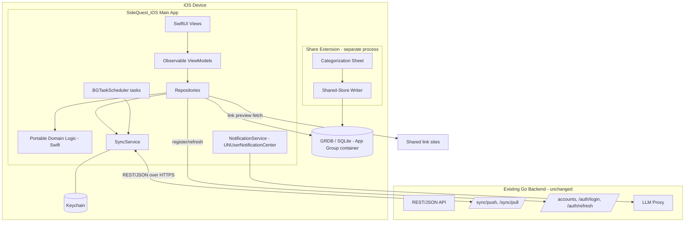
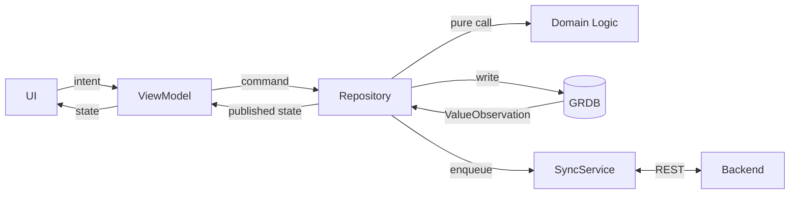
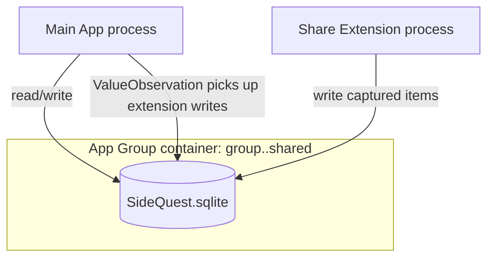

# Design Document

## Overview

The **iOS Client** ("SideQuest_iOS") is a native SwiftUI iPhone application that delivers feature parity with the existing Android client by consuming the existing Go backend through the same OpenAPI 3 contract (`backend/api/openapi.yaml`). It is an additive spec: it changes neither the backend, the OpenAPI contract, nor the Android client.

The design follows the iOS reuse path that the sibling `action-tracker-app` design already mapped out:

| Layer | Shared decision | iOS realization |
| --- | --- | --- |
| Backend API | Single Go REST/JSON API, unchanged | Consumed unchanged over HTTPS |
| API contract | OpenAPI 3 (`backend/api/openapi.yaml`) | Swift `Generated_Models` produced from the same schema |
| Domain models | Generated/mirrored from the OpenAPI schema | Swift structs generated from the same schema |
| Sync protocol | Versioned, timestamped, last-writer-wins + tombstones over REST | Identical protocol; `/sync/push` and `/sync/pull` |
| Portable domain logic | Specified once, validated by shared Correctness Properties | Re-implemented in Swift; validated by the *same* properties |
| Client UI / runtime | Kotlin + Jetpack Compose + Room + WorkManager (Android) | SwiftUI + GRDB (SQLite) + BGTaskScheduler + UNUserNotificationCenter |

The system is **offline-first**: the iOS client owns a local source of truth (an on-device SQLite database) and synchronizes with the backend in the background. Users can capture, view, and edit Action_Items with no network connection; changes reconcile when connectivity returns. Network-dependent enrichment (link previews, LLM text) degrades gracefully and never blocks the core capture flow.

This spec scopes the iOS client only and covers the capabilities that have direct iOS-platform concerns: capture via a Share Extension, on-device persistence, local/push notifications anchored to local time, iOS permission flows, background synchronization via `BGTaskScheduler`, accounts/sync, the action board and completion counter, buckets/timeframes/action planning, the loading "thought of the day", and App Store distribution/signing.

### Goals

- Native SwiftUI experience on iPhone with functional equivalence to the Android client (Req 1.6).
- Reuse the backend and OpenAPI contract unchanged, communicating exclusively over REST/JSON (Req 2).
- Portable domain logic in Swift that produces field-by-field identical results to the Android client and the server, validated by the shared Correctness Properties (Req 3).
- Reliable offline-first persistence with eventual cross-device sync (Req 5, 6, 10).
- Reminders and nudges scheduled through the iOS notification system, anchored to local time and surviving reboots (Req 7).
- App Store-ready packaging with correct entitlements, App Group, and background-task declarations (Req 13).

### Relationship to the `action-tracker-app` spec

The portable domain logic (board aggregation, completion counting, timeframe/due-set resolution, bucket validation, action-plan progress, sync conflict resolution) is the *same* logic specified in the sibling spec. Rather than redefine its behavior, this design **reuses the sibling's Correctness Properties** for that logic (Req 3.2) and adds new properties only for behavior unique to the iOS client (share-extension capture, client-id uniqueness, notification scheduling/anchoring, background-sync semantics, deterministic thought-of-the-day, distribution validation). Each reused property is cited by its sibling number; each new property is numbered locally.

## Architecture

### High-Level Architecture



The Share Extension and the main app are **separate iOS processes** that share one SQLite database located in a shared **App Group** container, so an item captured in the extension appears in the main app (Req 4.10, 13.2).

### Client Architecture (MVVM + Repository)

The client uses MVVM with unidirectional data flow, mirroring the Android architecture so the layering stays parallel:

- **SwiftUI Views**: stateless views render state published by view models.
- **ViewModels** (`@Observable` / `ObservableObject`): hold screen state, handle user intents, call repositories. They never talk to the network or database directly.
- **Repositories**: the single entry point for data. They read/write the local store, enqueue sync work, and orchestrate enrichment (previews, LLM). They expose GRDB `ValueObservation` streams so views update reactively as the local DB changes.
- **Portable Domain Logic**: pure Swift functions/types with no I/O — board aggregation, completion counting, timeframe/due-set resolution, bucket-name validation, action-plan progress, and sync conflict resolution. This is the layer governed by the shared Correctness Properties (Req 3.1, 3.2).
- **Local store (GRDB/SQLite)**: the source of truth. All display reads come from the store, guaranteeing offline availability (Req 5.1, 5.2).
- **SyncService**: pushes local changes and pulls remote changes through the contract; runs on foreground transitions and via `BGTaskScheduler` in the background.
- **NotificationService**: schedules `UNNotificationRequest`s with calendar triggers anchored to the local time zone.



### Recommended Technology Stack (iOS)

- Language: **Swift** (latest stable), **SwiftUI** for all user-facing screens (Req 1.4).
- Local DB: **GRDB** over SQLite (value observation, migrations, WAL) stored in the App Group container.
- Background work: **BGTaskScheduler** (`BGAppRefreshTask` for short syncs, `BGProcessingTask` for longer catch-up syncs) (Req 6.5).
- Notifications: **UNUserNotificationCenter** with `UNCalendarNotificationTrigger` (Req 7).
- Networking: **URLSession** with `async/await`; JSON via `Codable` on the `Generated_Models`.
- Generated models: Swift types generated from `backend/api/openapi.yaml` (e.g., via an OpenAPI generator) (Req 2.2).
- Auth token storage: **iOS Keychain** (Req 10.4).
- Share target: a **Share Extension** declared with an App Group (Req 4.1, 13.2).
- Link previews: **LinkPresentation** (`LPMetadataProvider`) with a 5-second timeout (Req 4.8, 4.9).
- Distribution: App Store distribution signing identity + provisioning profile (Req 13.1).

### Process and storage boundaries



Because two processes write to one SQLite file, the database is opened in **WAL mode** with a coordinated `DatabasePool`, and writes are committed durably before an operation reports complete (Req 5.5). The Keychain entries used for tokens are scoped to a shared access group so both processes can authenticate sync if needed.

### Why these iOS mechanisms are required

Several requirements cannot be met with plain in-app code and map directly to platform facilities:
- Receiving shared content from other apps requires a **Share Extension** (Req 4.1).
- Sharing captured data between the extension and the main app requires an **App Group** container (Req 4.10, 13.2).
- Running sync while backgrounded requires registering **BGTaskScheduler** identifiers declared in `Info.plist` (Req 6.5, 13.3).
- Wall-clock reminders that survive time-zone changes and reboots require **UNCalendarNotificationTrigger** scheduled with the system, which persists across reboots (Req 7.10, 7.11).
- Secure token storage requires the **Keychain** (Req 10.4).

## Components and Interfaces

### CaptureService (Share Extension)

The Share Extension registers SideQuest_iOS as a share target by declaring `NSExtensionActivationRule` for URLs, plain text, images, and movies (Req 4.1). A `ShareViewController` (hosting a SwiftUI categorization sheet) receives the shared item.

Flow:
1. Read shared attachments → classify content type (link, text, image, video reference).
2. If the type is not one of the supported set → show "content type not supported", discard the item, end the extension request (Req 4.4).
3. Otherwise present the categorization sheet requiring exactly one Bucket and exactly one Timeframe; saving is disabled until both are chosen (Req 4.3).
4. If the content contains a link, start asynchronous metadata fetch via `LinkPresentation`; the user may confirm before it returns (Req 4.8).
5. On confirm → create an Action_Item with status "not started" and write it to the shared store (Req 4.5, 4.10).
6. On store-write failure → show error, create no partial item, retain the user's selections for retry (Req 4.6).
7. On cancel before confirm → discard without creating an item (Req 4.7).

```swift
enum ContentType { case link, text, image, videoRef, unsupported }

protocol CaptureService {
    func classify(_ attachments: [SharedAttachment]) -> ContentType
    func beginCapture(_ item: SharedItem) -> CaptureDraft
    func confirmCapture(_ draft: CaptureDraft,
                        bucketId: String,
                        timeframe: Timeframe) throws -> ActionItem  // throws on store failure
}
```

### PreviewService (link metadata)

Fetches Open Graph / link metadata for shared URLs off the capture critical path with a default 5-second timeout (Req 4.8, 4.9).

```swift
enum PreviewResult {
    case success(title: String, thumbnailUrl: String?, sourceName: String)
    case fallback(rawUrl: String)   // failure or timeout -> display raw link
}

protocol PreviewService {
    func fetchPreview(_ url: URL, timeout: TimeInterval) async -> PreviewResult
}
```

On success the Action_Item stores resolved preview fields; on failure or timeout it stores a preview marked unresolved whose `rawUrl` equals the original URL and capture still completes (Req 4.9). If a later background fetch succeeds, the item updates reactively via its `ValueObservation`.

### Board and CompletionCounter

The board view renders an aggregated `BoardState` derived by the portable domain logic from the local store: Action_Items grouped by Bucket, sorted ascending by `createdAt` within each bucket and tie-broken by ascending id (Req 8.1). Each item carries a status color drawn from the bucket's per-status color map such that distinct statuses map to distinct colors (Req 8.2). The CompletionCounter is the count of items with status "completed", clamped at zero, recomputed reactively on every status change (Req 8.5, 8.6).

The press-and-hold completion control is a SwiftUI gesture that drives a progressive fill whose proportion equals `elapsedHold / 800ms`; it completes only at 800 ms continuous hold, then sets status to "completed", fires haptics, and plays a ≤2000 ms celebration animation; releasing early cancels and resets with no status change (Req 8.7, 8.8, 8.9).

### Bucket management

CRUD over buckets with normalized (trimmed, case-insensitive) uniqueness per account (Req 9.2) and a 1–50 character length rule (Req 9.3). Deleting a non-empty bucket triggers a reassign-or-delete decision when another bucket exists (Req 9.4), or a confirm-delete-contained-items prompt when it is the last bucket (Req 9.5).

### NotificationService

Built on `UNUserNotificationCenter`. Requests notification permission on first use of a notifying feature, exactly once (Req 7.1, 11.1). All schedules use `UNCalendarNotificationTrigger` with `DateComponents` (hour/minute), which the system evaluates in the device's current local time zone, so a notification fires at the intended wall-clock time even after a time-zone change (Req 7.10) and pending requests persist across reboots (Req 7.11).

- **Task_Reminder**: one-shot or daily-recurring trigger until the until-date; cancelled when the item is completed; stops at the until-date (Req 7.6–7.9).
- **Collective_Evening_Nudge**: one daily notification summarizing up to 20 not-completed items with no Task_Reminder; omitted when no eligible items exist that day (Req 7.13, 7.14).
- **Global_Daily_Notification**: optional daily self-reminder at a chosen time (Req 7.15).
- Notification text is requested from the LLM_Proxy (≤200 chars); on timeout (5 s) or error it falls back to default text (Req 7.16, 7.17).
- On denied permission: show an explanation and a deep link to the iOS notification settings (Req 7.18, 11.4).

```swift
protocol NotificationService {
    func requestAuthorizationIfNeeded() async -> NotificationAuthStatus
    func scheduleTaskReminder(for item: ActionItem, reminder: TaskReminder) async
    func cancelReminders(for itemId: String) async
    func scheduleEveningNudge(at time: TimeOfDay, items: [ActionItem]) async
    func scheduleGlobalDaily(at time: TimeOfDay) async
    func rescheduleAllPending() async   // called on launch / after reboot detection
}
```

### LLMService (via backend LLM Proxy)

The client never holds provider keys; it calls the backend LLM Proxy (`/llm/notification-text`) with a 5-second timeout and fails soft to default text (Req 7.16, 7.17).

```swift
enum LlmResult { case ok(String), unavailable, timedOut }

protocol LLMService {
    func notificationText(for items: [ActionItemSummary]) async -> LlmResult
}
```

### SyncService

The repository writes locally first, then enqueues sync. The SyncService implements the shared protocol against the contract:

```
POST /sync/push  { changes: [ActionItem...], lastSyncToken }  -> { applied, newSyncToken }
GET  /sync/pull?since={syncToken}                             -> { changes: [ActionItem...], newSyncToken }
```

- **Last-writer-wins** conflict resolution keyed on the record update time, tie-broken deterministically by record id (Req 6.2). This is the same resolution rule as sibling Property 32.
- **Tombstones** (`sync.deleted = true`) propagate deletes to all devices (Req 6.3).
- **Idempotent pushes** keyed on the client-generated entity id, so retries never create duplicates (Req 6.8); the server dedupes by account + id.
- On connectivity restore, foreground entry, or a `BGTaskScheduler` run, a sync pass executes (Req 6.4, 6.5, 6.6).
- First sign-in on a device performs a full pull into the local store; a failed first pull is all-or-nothing (no partial import), shows a message, and retries next pass (Req 6.7, 6.10).
- On push/pull failure, unsynchronized changes are retained and retried up to a configured maximum, preserving local state on total failure (Req 6.9).

```swift
protocol SyncService {
    func push() async throws -> SyncOutcome
    func pull(since token: Int64?) async throws -> SyncOutcome
    func fullPullForFirstSignIn() async throws   // all-or-nothing
    func registerBackgroundTasks()               // BGTaskScheduler identifiers from Info.plist
}
```

### AuthService and token storage

Handles account registration (`POST /accounts`), sign-in (`POST /auth/login`), and refresh (`POST /auth/refresh`) per the contract's `bearerAuth` (JWT) scheme (Req 2.4, 10.1, 10.8). Access and refresh tokens are stored in the **iOS Keychain** (Req 10.4). On access-token expiry the client refreshes silently without touching the local store (Req 10.5); on refresh failure it routes to re-authentication while preserving the local store (Req 10.7).

### BackendClient and error mapping

A thin `URLSession` client over the `Generated_Models`. It maps contract-defined structured errors to category-specific user-facing messages while preserving unsaved input (Req 2.5); treats undefined errors and >30 s timeouts as transient and retries up to 3 times (Req 2.6); and on authentication failure shows an auth-failure message without auto-retry (Req 2.7).

### LoadingExperience (thought of the day)

At launch, within 500 ms, the app shows a deterministic "thought of the day" selected from a built-in on-device set of ≥30 thoughts, keyed on the device's local calendar date, rendered in the SideQuest visual style fully visible and centered across all supported screen sizes; if selection fails it shows a default fallback without surfacing an error (Req 12).

```swift
protocol ThoughtProvider {
    func thought(forLocalDate date: Date) -> Thought   // deterministic; falls back to default
}
```

### DistributionConfig (build-time)

Declares the App ID, the Share Extension as an associated app extension, the shared App Group identifier (identical in both targets), every `BGTaskScheduler` identifier the app registers, the entitlements/capabilities for notifications + background processing + App Group, and non-empty usage-description strings for runtime-prompted permissions (Req 13.2–13.5). Missing usage-descriptions or mismatched entitlement/App Group/App ID declarations cause App Store submission validation to fail (Req 13.6, 13.7).

## Data Models

Models are defined by the shared **OpenAPI 3 schema** and expressed as Swift structs in `Generated_Models`. IDs are client-generated UUIDs so records can be created offline without server round-trips (Req 5.7). All syncable entities carry sync metadata identical in shape to the sibling design so the wire format matches the contract.

```swift
// Common sync metadata embedded in syncable entities (mirrors the contract's sync object)
struct SyncMeta: Codable {
    var updatedAt: Int64   // epoch millis, server-authoritative after ack
    var version: Int64     // increments per update; concurrency detection
    var deleted: Bool      // tombstone flag
    var dirty: Bool        // client-only: pending push
}

enum ActionStatus: String, Codable { case notStarted, inProgress, completed }

enum Timeframe: Codable, Equatable {
    case today
    case withinADay
    case withinAWeek
    case specificDate(Date)   // must be the current local date or later
}

enum ContentType: String, Codable { case link, text, image, videoRef }

struct LinkPreview: Codable, Equatable {
    var title: String?
    var thumbnailUrl: String?
    var sourceName: String?
    var rawUrl: String
    var resolved: Bool   // false => display rawUrl
}

struct ActionItem: Codable, Identifiable, Equatable {
    var id: String                 // client-generated UUID
    var accountId: String
    var bucketId: String
    var title: String
    var description: String?        // may be LLM-generated
    var contentType: ContentType
    var sourceContent: String?      // raw text / link / media reference
    var preview: LinkPreview?       // present for link items
    var timeframe: Timeframe
    var status: ActionStatus
    var createdAt: Int64            // ordering within bucket
    var sync: SyncMeta
}

struct Bucket: Codable, Identifiable, Equatable {
    var id: String
    var accountId: String
    var name: String                // unique per account (normalized)
    var notStartedColor: String     // status indicator colors; distinct per status
    var inProgressColor: String
    var completedColor: String
    var sync: SyncMeta
}

struct ActionPlan: Codable, Identifiable, Equatable {
    var id: String
    var actionItemId: String
    var subActions: [SubAction]     // ordered, 1...100
    var sync: SyncMeta
}

struct SubAction: Codable, Identifiable, Equatable {
    var id: String
    var text: String
    var order: Int                  // defines sequence (contiguous)
    var completed: Bool
}

struct TaskReminder: Codable, Equatable {
    var actionItemId: String
    var timeOfDay: TimeOfDay        // hour + minute in device local time zone
    var untilDate: Date             // current date ... current date + 365 days
    var recurringDaily: Bool
}

struct TimeOfDay: Codable, Equatable {
    var hour: Int                   // 0...23
    var minute: Int                 // 0...59
}

struct Account: Codable, Identifiable {
    var id: String
    var email: String
    var displayName: String
    var createdAt: Int64
}

struct Thought: Codable, Equatable {
    var id: Int
    var text: String                // 1...280 characters
}
```

### Persistence notes

- GRDB stores all of the above; the `Timeframe` enum is persisted as a discriminator + payload, mirroring the Android type-converter approach so values round-trip identically.
- The SQLite file lives in the App Group container and is shared by the main app and the Share Extension (WAL mode, coordinated access) (Req 4.10).
- The backend schema and the Android client already define equivalent entities; the iOS structs are generated from the same OpenAPI schema, so the on-the-wire JSON is identical across platforms (Req 2.2, 3.3).
- The portable-domain entities used by the shared logic (Action_Item, Bucket, Action_Plan, Timeframe) match the sibling design's models so the shared Correctness Properties apply unchanged.

## Correctness Properties

*A property is a characteristic or behavior that should hold true across all valid executions of a system — essentially, a formal statement about what the system should do. Properties serve as the bridge between human-readable specifications and machine-verifiable correctness guarantees.*

The iOS client's portable domain logic is the **same logic** specified once in the `action-tracker-app` design. Requirement 3 requires that this Swift logic satisfy the **same Correctness Properties** as the Android client and the server, producing field-by-field identical results. Accordingly, this section is organized in two parts:

1. **Reused properties** — properties defined in the sibling `action-tracker-app` design that the iOS Swift domain logic MUST satisfy unchanged. They are referenced by their sibling numbers rather than restated, to keep a single source of truth.
2. **iOS-specific properties** — new properties for behavior unique to the iOS client (cross-implementation equivalence, share-extension/shared-store persistence, client-id uniqueness, notification scheduling/anchoring, idempotent/atomic sync, retry/error invariants, hold-gesture progress, deterministic thought-of-the-day, fail-soft LLM text).

### Reused properties (from `action-tracker-app` design)

The iOS Swift implementations of the portable domain logic MUST satisfy the following sibling properties for every valid input. These are validated by re-implementing the same property tests against the Swift logic (see Testing Strategy).

| Sibling property | Governs | iOS requirement covered |
| --- | --- | --- |
| Property 5 — Bucket names unique per account | Bucket validation | 9.2 |
| Property 6 — Deleting a non-empty bucket reassigns or deletes all items | Bucket delete | 9.4, 9.5 |
| Property 7 — Specific-date timeframe accepts today-or-later, rejects past | Timeframe validation | 9.7 |
| Property 8 — Board partitions items by bucket without loss | Board aggregation | 8.1 |
| Property 9 — Items within a bucket ordered by ascending creation time | Board ordering | 8.1 |
| Property 10 — Status indicator color always matches current status | Status color | 8.2, 8.3 |
| Property 11 — Completion counter equals the number of completed items | Completion counter | 8.5, 8.6 |
| Property 16 — Sub-action progress count is accurate | Action-plan progress | 9.9 |
| Property 17 — "Mark complete" prompt appears exactly when all sub-actions done | Action-plan prompt | 9.10 |
| Property 18 — Reordering sub-actions is a permutation with contiguous ordering | Action-plan reorder | 9.8 |
| Property 29 — Data created while signed in is associated with the current account | Account association | 10.2 |
| Property 30 — Sync makes data available across devices (round trip) | Cross-device sync | 10.3 |
| Property 31 — Persistence round trip survives restart, edits, and deletes | Local persistence | 5.4 |
| Property 32 — Conflict resolution is deterministic last-writer-wins | Sync conflict resolution | 6.2 |
| Property 1 — Unsupported content is rejected and never persisted | Capture classification | 4.4 |
| Property 2 — Confirming capture creates a not-started item preserving bucket/timeframe | Capture confirm | 4.5 |
| Property 4 — Unresolved preview falls back to raw link without blocking capture | Link preview | 4.9 |

### iOS-specific properties

### Property 1: Cross-implementation equivalence of portable domain logic

*For any* valid input to the portable domain logic (board aggregation, completion counting, timeframe/due-set resolution, bucket validation, action-plan progress, sync conflict resolution), the Swift implementation's output is field-by-field identical to the reference output produced by the Android client and the backend for the same input, with identical numeric values and, for ordered outputs (such as bucket grouping), identical element ordering.

**Validates: Requirements 1.6, 3.2, 3.3**

### Property 2: Captured items are visible across the extension/main-app process boundary

*For any* Action_Item created through the Share Extension's confirm path, after the write commits to the shared App Group store, reading the store from the main app returns an item field-by-field equal to the captured item.

**Validates: Requirements 4.10**

### Property 3: Capture and commit failures never leave partial state and retain user input

*For any* capture confirmation or local-store mutation that fails to commit, the persisted store equals its prior state (no partial entity is written) and the user's input/selections are retained.

**Validates: Requirements 4.6, 5.8**

### Property 4: Client-generated identifiers are globally unique

*For any* number of new entities created across any number of simulated devices without coordination, the set of generated identifiers contains no duplicates, so records can be created offline without sync collisions.

**Validates: Requirements 5.7**

### Property 5: Local mutations are marked pending and stay pending until acknowledged

*For any* sequence of create/edit/delete mutations and sync attempts, every mutated entity is marked dirty when changed and remains dirty until a successful push acknowledgment for that entity clears it.

**Validates: Requirements 5.6**

### Property 6: Synchronization pushes are idempotent by client identifier

*For any* push payload submitted one or more times (including retries), the resulting record set contains exactly one record per client-generated identifier, so retried pushes never create duplicates.

**Validates: Requirements 6.8**

### Property 7: First-sign-in pull is atomic

*For any* first-sign-in pull that fails partway through, the local store contains none of the records from that pull (all-or-nothing import), and the unsynchronized state is preserved for a retry on the next pass.

**Validates: Requirements 6.10**

### Property 8: Sync failures retain changes within a bounded retry count and preserve state

*For any* sequence of push/pull failures, the number of retry attempts for a change does not exceed the configured maximum, the unsynchronized changes are retained across attempts, and on total failure the local store equals its pre-sync state.

**Validates: Requirements 2.6, 6.9**

### Property 9: Deletes propagate via tombstones across a sync round trip

*For any* entity deleted on one device, after a push/pull round trip the entity is represented as a tombstone such that a second device signed in to the same account no longer surfaces the record among its non-deleted records.

**Validates: Requirements 6.3**

### Property 10: Reminder occurrences are exactly the scheduled day-set up to the until-date

*For any* Task_Reminder, the set of scheduled occurrence dates equals: for a one-shot reminder, the single next reminder date on or before the until-date; for a recurring reminder, every day from the start date up to and including the until-date — and contains no date after the until-date, and none once the Action_Item is marked completed.

**Validates: Requirements 7.7, 7.9**

### Property 11: Completing an item cancels all of its pending reminders

*For any* Action_Item with any number of scheduled reminders, marking it completed results in zero pending scheduled reminder requests associated with that Action_Item.

**Validates: Requirements 7.8**

### Property 12: Scheduled notifications are anchored to local wall-clock time

*For any* scheduled notification (Task_Reminder, evening nudge, global daily), the trigger is constructed from local time components (hour/minute, optionally calendar date) rather than a fixed absolute instant, so the fire time tracks the configured wall-clock time when the device time zone changes.

**Validates: Requirements 7.10**

### Property 13: Until-date selection is accepted exactly within the valid window

*For any* candidate until-date, the selection is accepted if and only if it is on or after the current local date and no more than 365 days after the current local date; rejected selections leave the user's other Task_Reminder values unchanged.

**Validates: Requirements 7.4**

### Property 14: The evening nudge selects only eligible items, capped at 20

*For any* set of Action_Items on a given day, the evening nudge's selected items are exactly those that are not completed and have no Task_Reminder set, truncated to at most 20; when that eligible set is empty, no nudge is scheduled for the day.

**Validates: Requirements 7.13, 7.14**

### Property 15: Notification text is bounded and fails soft

*For any* LLM_Proxy outcome, the text used for a notification is at most 200 characters; and when the LLM result is unavailable, errored, or not returned within the timeout, the notification is delivered using non-empty default text.

**Validates: Requirements 7.16, 7.17**

### Property 16: A failed status change preserves the prior status and indicator

*For any* Action_Item whose status change fails to persist, the item's stored status and its displayed color indicator remain equal to their values before the attempted change.

**Validates: Requirements 8.4**

### Property 17: Status-to-color mapping is injective per bucket

*For any* bucket color configuration, the mapping from Action_Status to indicator color is injective: no two distinct status values map to the same color.

**Validates: Requirements 8.2**

### Property 18: Press-and-hold progress is proportional and completes only at the threshold

*For any* elapsed continuous hold time `t`, the progressive fill proportion equals `min(t / 800ms, 1)`, completion occurs if and only if `t >= 800ms`, and any release with `t < 800ms` resets the fill to empty and leaves the Action_Status unchanged.

**Validates: Requirements 8.7, 8.9**

### Property 19: Bucket-name length validation accepts exactly 1–50 trimmed characters

*For any* candidate bucket name, creation or rename is accepted (with respect to the length rule) if and only if the name's length after trimming surrounding whitespace is between 1 and 50 inclusive; empty, whitespace-only, and over-50 names are rejected.

**Validates: Requirements 9.3**

### Property 20: Token refresh and refresh failure preserve the local store

*For any* access-token refresh, whether it succeeds or fails, the local store is unchanged by the refresh; on failure the user is routed to re-authentication with the local store preserved.

**Validates: Requirements 10.5, 10.7**

### Property 21: Contract-defined errors map to category-specific messages preserving input

*For any* contract-defined structured error category returned by the backend, the client produces a user-facing message specific to that category and preserves any unsaved user input.

**Validates: Requirements 2.5**

### Property 22: A permission prompt is triggered at most once per capability

*For any* sequence of permission interactions, once iOS permission for a capability has been granted or denied, the system permission prompt for that capability is not triggered again (at most one prompt per capability).

**Validates: Requirements 11.1, 11.5**

### Property 23: Thought-of-the-day selection is deterministic by local date and fails soft

*For any* local calendar date, thought-of-the-day selection is deterministic — every selection on the same local date yields the same thought, and a date crossing a local calendar-day boundary may yield a different thought — and if the selected thought cannot be retrieved, a non-empty default fallback thought is returned without surfacing an error.

**Validates: Requirements 12.2, 12.5**

## Error Handling

The iOS client is designed to fail soft and keep the core capture/track experience usable regardless of network or external-service failures.

### Capture and previews
- **Unsupported content**: show "content type not supported", discard the item, end the extension request (Req 4.4).
- **Preview failure or timeout (5 s)**: complete capture immediately with the raw link stored and displayed; a later successful background fetch updates the item reactively via `ValueObservation` (Req 4.9).
- **Store-write failure in the extension**: surface an error, create no partial item, retain the user's bucket/timeframe selections for retry (Req 4.6).

### Local persistence
- All reads/writes hit the GRDB store first; writes commit durably (WAL) before an operation reports complete (Req 5.5).
- A failed commit preserves the prior persisted state, retains input, and shows a "not saved" indication (Req 5.8).

### Network and sync
- `/sync/push` and `/sync/pull` run as foreground passes and `BGTaskScheduler` background tasks; transient failures are retried with backoff up to a configured maximum and are not surfaced as hard errors (Req 6.9).
- Conflicts resolve via deterministic last-writer-wins on update time, tie-broken by record id (Req 6.2).
- Deletes propagate via tombstones so a delete on one device is not resurrected by a stale record (Req 6.3).
- First-sign-in pull is atomic: a mid-pull failure imports nothing, shows a message, and retries next pass (Req 6.10).

### Backend errors and auth
- Contract-defined structured errors map to category-specific user-facing messages while preserving unsaved input (Req 2.5).
- Undefined errors and requests exceeding 30 s are treated as transient and retried up to 3 times (Req 2.6).
- Authentication failures show an auth-failure message and are not auto-retried (Req 2.7).
- Expired access tokens trigger a silent Keychain-backed refresh that leaves the local store untouched (Req 10.5); a failed refresh routes to re-authentication without data loss (Req 10.7).

### LLM and notifications
- LLM_Proxy notification-text calls are time-boxed at 5 s and bounded at 200 characters; on error/timeout the notification uses non-empty default text (Req 7.16, 7.17).
- Notification permission denied: show an explanation and a deep link to the iOS notification settings; non-dependent features stay fully operable (Req 7.18, 11.3, 11.4).

### Loading
- If the deterministically selected thought cannot be retrieved, show a default fallback thought and complete loading without surfacing an error (Req 12.5).

### Distribution validation
- Missing usage-description strings, or mismatched/missing entitlements, capabilities, App Group, or App ID declarations, fail App Store submission validation with a result indicating the specific missing or mismatched declaration (Req 13.6, 13.7).

## Testing Strategy

The iOS client contains substantial pure logic — the portable domain logic shared with Android/Go (board aggregation, completion counting, timeframe/due-set resolution, bucket validation, action-plan progress, sync conflict resolution) plus iOS-specific logic (capture classification, client-id generation, reminder-occurrence computation, notification-text bounding, hold-gesture progress, deterministic thought selection, retry/idempotence/atomicity). This logic is well suited to **property-based testing**. Platform/OS integration (Share Extension registration, BGTaskScheduler, UNUserNotificationCenter delivery timing, Keychain), UI placement/rendering, and external-service behavior are covered with example, integration, and smoke tests.

### Dual approach

- **Property-based tests** verify the universal Correctness Properties above (both the reused sibling properties re-run against the Swift logic, and the iOS-specific properties) across many generated inputs.
- **Example/unit tests** verify specific scenarios, UI branches, and concrete flows.
- **Integration tests** verify external/OS wiring (sync endpoints, Keychain token storage, notification delivery, account creation) with 1–3 representative cases.
- **Smoke tests** verify one-time configuration (Share Extension registration, App Group, BGTaskScheduler identifier declarations, entitlements, permission prompt-on-first-use, build/run on a supported iPhone).

### Property-based testing setup

- **Library**: use **SwiftCheck** (or **swift-testing** with a generator layer) rather than implementing property testing from scratch.
- **Iterations**: each property test runs a **minimum of 100 iterations**.
- **Generators**: build Swift generators for Action_Items (all Timeframe variants and content types), bucket sets with color configs, Action_Plans (1–100 sub-actions) and reorder requests, status-change sequences, reminder configs with until-dates spanning the ±/365-day boundary, item sets for evening-nudge selection, error/failure sequences for retry/idempotence/atomicity, ID batches across simulated devices, local-date sequences for thought selection, and pairs of concurrent record versions for conflict testing.
- **Cross-implementation equivalence (Property 1)**: drive the Swift logic with shared golden input/output vectors (the same fixtures used to validate the Android/Go implementations) and assert field-by-field, ordering-exact equality. This is the mechanism that operationalizes Req 3.2/3.3.
- **Reused sibling properties**: re-implement sibling Properties 1, 2, 4, 5, 6, 7, 8, 9, 10, 11, 16, 17, 18, 29, 30, 31, 32 against the Swift domain logic. Tag each with the sibling reference, e.g. `// Validates action-tracker-app Property 8 (ios-client Req 8.1)`.
- **Traceability**: tag each property test with a comment referencing its design property, in the format:
  - `// Feature: ios-client, Property {number}: {property_text}`
  - For reused properties: `// Feature: ios-client (reuses action-tracker-app Property {n}), Property text...`
- Implement **each Correctness Property with a single property-based test** (iOS-specific Properties 1–23, plus the reused sibling properties).

### Example/unit tests (representative)

- Share intent receipt launches the categorization flow; save disabled until a bucket and timeframe are chosen (Req 4.2, 4.3).
- Cancel before confirm discards the item (Req 4.7); link item allows confirm before metadata returns (Req 4.8).
- Bucket create/rename/delete CRUD (Req 9.1); timeframe option set (Req 9.6); last-bucket delete confirm flow (Req 9.5).
- Status change persists and updates color (Req 8.3); completion via 800 ms hold triggers haptic + celebration (Req 8.8).
- Reminder time/recurrence affordances and missing-time rejection (Req 7.2, 7.3, 7.5); global daily enable/disable (Req 7.15); permission-denied explanation + settings link (Req 7.18, 11.4).
- Account creation failure retains inputs (Req 10.6); invalid sign-in rejected with message (Req 10.8).
- Thought-of-the-day appears within budget and renders centered without truncation (Req 12.1, 12.4).
- Submission-validation function flags a missing usage-description / mismatched declaration (Req 13.6, 13.7).

### Integration tests

- `/accounts`, `/auth/login`, `/auth/refresh` against a mocked backend, including token storage in the Keychain (Req 2.4, 10.1, 10.4).
- `/sync/push` and `/sync/pull` round trip making data available on a second device (Req 6.1, 6.7, 10.3) — 1–3 cases.
- Notification delivery within 60 s of the scheduled local time and survival across a simulated reboot (Req 7.6, 7.11) — representative cases.

### Smoke tests

- `Info.plist` declares the Share Extension with `NSExtensionActivationRule` for link/text/image/movie (Req 4.1).
- App Group identifier is identical in both targets (Req 13.2); every registered `BGTaskScheduler` identifier matches a declared identifier and none is left unregistered (Req 13.3, 6.5).
- Entitlements/capabilities for notifications, background processing, and App Group are present (Req 13.4); non-empty usage-description strings exist for runtime-prompted permissions (Req 11.2, 13.5).
- Notification permission requested exactly once on first use (Req 7.1, 11.1); app builds and runs on a supported iPhone / Minimum_iOS_Version (Req 1.1, 1.2, 1.3).

### Cross-platform consistency note

Because the Correctness Properties target portable logic and a shared API contract, the reused sibling property specifications run against the iOS Swift domain logic give the same behavioral guarantees the Android (Kotlin) and backend (Go) implementations are held to. Property 1 closes the loop by asserting the Swift outputs equal the shared reference vectors field-by-field, which is the concrete realization of the Requirement 3 parity guarantee.
